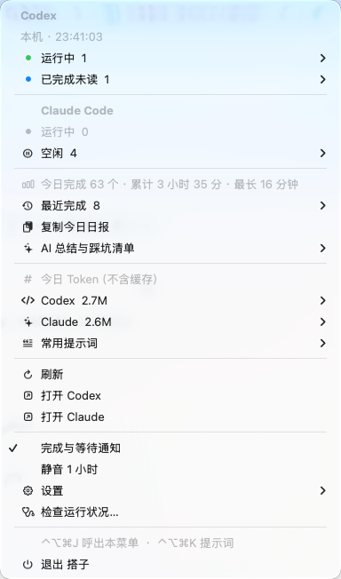
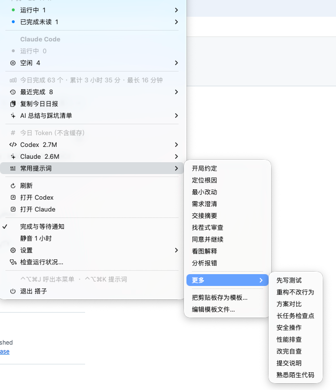

<p align="center">
  
</p>

<h1 align="center">搭子 · Buddy</h1>

<p align="center">
  macOS 菜单栏里的 AI 编程搭子。<br>
  盯着本机的 <b>Codex Desktop</b> 和 <b>Claude Desktop（Claude Code）</b>，任务做完、AI 在等你、<br>
  会话上下文快满、当天用量超预算时，提醒你一声。
</p>

<p align="center">
  <a href="README.md">English</a> · 简体中文 · <a href="docs/privacy.zh-CN.md">隐私说明</a> · <a href="docs/architecture.md">架构</a> · <a href="CONTRIBUTING.md">贡献指南</a>
</p>

> **非官方项目。** 与 OpenAI、Anthropic 没有任何隶属、认可或赞助关系。“Codex”“ChatGPT”“Claude”是各自所有者的商标，这里只用来说明兼容对象。

> **使用前请先看——兼容性。** 本工具读取的是 Codex Desktop 与 Claude Desktop 的**未公开本地文件**。目前只在 **macOS 26.6（Apple Silicon）**、**Codex Desktop 26.924.22138**、**Claude Desktop 2.16120.0**（Claude Code 引擎 2.1.284）上验证过。这两个应用以后更新都可能改变这些格式。工具的原则是“读不准就显示未知（`?` / `--`），绝不给错误的数字”，并自带健康检查告诉你原因；但大版本更新后，仍可能需要升级本工具。

## 截图

<p align="center">
  
  &nbsp;&nbsp;
  
</p>

<sub>macOS 26.6，浅色模式。`CodexStatus --dump-menu` 可打印当前真实的完整菜单树。</sub>

## 为什么做它

用 AI 编程时，时间主要浪费在三处：盯着屏幕等任务跑完；AI 停下来等你批准，你却没发现；对话悄悄变得太长，模型开始遗忘前面的内容。搭子把这些信息放进菜单栏，只在需要你的时候提醒你。

## 功能

**一眼看清**
- 两个工具合并成一个紧凑的菜单栏项：彩色圆点加数字——绿=运行中，橙=在等你，蓝=已完成未读。数字为零的圆点不显示，全部空闲时只剩图标。
- 对不确定如实说明：读不准的状态显示 `?` / `--`，不会编一个 `0`。
- 每个会话的已运行时间、按项目文件夹分组、最近完成列表、一键复制当天日报。

**通知**
- 任务完成（有最短时长门槛，短任务不打扰）、停下来等你输入或审批、运行特别久、上下文快满、当天用量超预算。
- 三层排版：发生了什么 / 项目与用时 / 任务名，带状态小图标，以及「打开」「静音 1 小时」按钮；点击可跳到对应的 Codex 会话或 Claude Code 会话。
- 勿扰时段、静音、各类阈值。

**Token 与上下文**
- 当天各工具的 Token 用量，分为新输入 / 输出 / 缓存命中，按项目统计，带近 7 天趋势和可选的每日预算。只给用量，不换算价格，也看不到套餐额度（本地日志里没有）。
- 每个会话的上下文占用（Codex 显示百分比；Claude 日志不含窗口大小，显示已占用的 token 数）。

**提示词模板**
- 常用提示词放在一个普通的 Markdown 文件里，菜单里点一下即复制。支持变量 `{项目}`（当前项目）、`{日期}`、`{剪贴板}`（也可写 `{project}` `{date}` `{clipboard}`），可“把剪贴板存为模板”，可按项目限定，有全局快捷键。

**可选的 AI 日报总结**（默认关闭，仅手动触发）
- 把当天的对话文字发给**你自己配置的接口**（OpenAI 兼容或 Anthropic 格式，自己的模型名和 Key），生成日报和一份长期的“踩坑清单”，可粘贴进新会话开头。使用前请阅读 [AI 总结](#ai-日报总结) 和[隐私说明](docs/privacy.zh-CN.md)。

**其他**
- 任务运行时保持电脑唤醒（默认关）、开机自动启动、全局快捷键 `⌃⌥⌘J`（呼出菜单）与 `⌃⌥⌘K`（提示词），以及**检查运行状况…**：解释为什么某处显示 `?`。

## 环境要求

- macOS 14 或更高（仅在 macOS 26.6、Apple Silicon 上验证过）。
- 本机安装并使用 Codex Desktop 和/或 Claude Desktop。
- 从源码构建需要 Xcode 16+ / Swift 6 工具链。**没有任何第三方依赖。**

## 安装

推荐从源码构建：

```sh
git clone https://github.com/Zheng-JL/ai_assistant.git
cd ai_assistant
bash scripts/install.sh
```

`scripts/install.sh` 会构建、跑测试、校验签名、备份旧版、把 `搭子.app` 装进 `~/Applications` 并启动。新版没起来会自动恢复旧版；构建或测试失败则不动已安装的应用。

- **请装在 `~/Applications` 或 `/Applications`。** macOS 只给这些目录里的应用授权通知、显示通知图标。不要去 `/tmp` 里 `open` 构建副本。
- **预编译 zip**（如果发布在 Releases 页）只有 *ad-hoc 签名*，**没有公证**（项目背后没有付费的 Apple 开发者账号），首次打开大概率被 Gatekeeper 拦截；从源码构建可以避免。打开未签名的下载文件由你自己决定。
- 它不会安装别的东西；除非你勾选，不会注册登录项；没有 Dock 图标，从菜单里退出。

首次启动时，macOS 询问时请允许通知。

## 使用

点击菜单栏图标（或按 `⌃⌥⌘J`）。示例（数据是编的）：

```
Codex
  本机 · 10:41:07
  ● 运行中  1  ▸
        修复登录失败  ·  6 分钟  ·  上下文 41%
  ● 已完成未读  0
────────
Claude Code
  ● 运行中  0
  空闲  2  ▸
        写发布说明  ·  12 分钟前
────────
今日完成 7 个 · 累计 52 分钟 · 最长 14 分钟
最近完成  ▸
复制今日日报
AI 总结与踩坑清单  ▸
今日 Token（不含缓存）
  Codex   63.4K  ▸  新输入 / 输出 / 缓存命中 / 按项目
  Claude  403.6K ▸
常用提示词  ▸
────────
刷新 · 打开 Codex · 打开 Claude
完成与等待通知 · 静音 1 小时 · 设置 ▸ · 检查运行状况…
退出
```

`CodexStatus --dump-menu` 会打印当前真实的完整菜单树。

### 提示词模板

模板在 `~/Library/Application Support/Codex Status/prompts.md`，首次使用时自动生成示例，**之后绝不覆盖你的文件**。

```markdown
## 先读后改
请先阅读相关代码，说明你的理解和修改计划，等我确认后再动手。

## 分析报错 @my-app
请分析下面的报错，在 {项目} 里先找到原因再改代码：
{剪贴板}

## 更多
## 提交说明
请为这次改动写提交说明：……
```

- `## 标题` 起一条模板，下面的内容就是复制的文本；单独一行 `## 更多`（或 `## More`）之后的模板收进“更多”子菜单。
- 标题末尾加 ` @项目文件夹名`，则只在该项目有会话时显示。
- 变量一次性替换（剪贴板里的花括号不会再被展开）；没有值时保持原样并在菜单栏提示。只有模板含 `{剪贴板}` 时才会读取剪贴板。

### AI 日报总结

配置之前一直是关闭的，而且只在你点击 **“现在总结今天…”** 时才运行。

1. 菜单 → “AI 总结与踩坑清单” → “总结设置…”：接口格式（OpenAI 兼容 / Anthropic）、请求地址、模型名称、API Key。Key **只保存在 macOS 钥匙串**。
2. “测试连接”只发一句 “ping”。
3. “现在总结今天…”会先弹出确认：收件地址、会话与消息数量、字符数和估算 token 数，确认后才发送。

结果是 `~/Library/Application Support/Codex Status/` 下的普通 Markdown：`journal/YYYY-MM-DD.md` 与 `lessons.md`（每次由模型合并去重，最多 30 条；上一版保留为 `lessons.md.bak`）。

**发送什么**：只发当天对话里人能读的文字（你说的话和 AI 回复的文字），经过裁剪并限制总量（默认约 6 万字符），且先做尽力而为的脱敏。**不发**：工具调用及输出、命令结果、文件内容、隐藏的推理、图片、系统注入的上下文、子智能体对话。远程地址必须是 `https`，`localhost` 可用 `http`。**脱敏基于正则，识别不了自定义格式的机密，请勿把机密写进对话。** 总结质量取决于你选的模型，每次运行会消耗该接口的 token。

## 数据存在哪里

| 内容 | 位置 |
| --- | --- |
| 偏好设置、最近完成、当天日志、Token 历史 | 应用的 `UserDefaults`（Bundle ID `com.zhengjl.codexstatus`） |
| 提示词模板 | `~/Library/Application Support/Codex Status/prompts.md` |
| 日报、踩坑清单 | `~/Library/Application Support/Codex Status/journal/`、`lessons.md` |
| 上一版应用（安装脚本的备份） | `~/Library/Application Support/Codex Status/previous/`（zip） |
| API Key | macOS 钥匙串，服务名 `com.zhengjl.codexstatus.llm` |

目录名和 Bundle ID 沿用了项目最初的名字（“Codex Status”），这样老用户不会丢设置。自己发布构建的 fork 应当改掉 Bundle ID。

## 排查问题

先点菜单里的**检查运行状况…**（或运行 `CodexStatus --health`）。它会检查安装位置、图标、重复登记、通知权限、Codex、Claude、Token 统计、AI 总结、快捷键，并对每个问题给出原因。

- **Codex/Claude 显示 `?` 或 `--`**：工具没法核验状态，常见于应用更新改变了内部格式。先看“检查运行状况…”，再带上它的输出和应用版本提 issue。
- **没有通知**：应用必须在 `~/Applications` 或 `/Applications` 里运行；然后到“系统设置 → 通知”里允许。
- **通知左侧是空白方块而不是应用图标**：macOS 缓存了应用还没有图标时的状态，或系统里还登记着同一 Bundle ID 的其他副本。先用 `lsregister -u <路径>` 注销多余副本，再结束 `NotificationCenter` 与 `iconservicesagent`（系统会自动重启），并删除当前用户的缓存目录 `$(getconf DARWIN_USER_CACHE_DIR)com.apple.iconservices` 和 `com.apple.iconservicesagent`。旧通知保留旧图标，请用 `CodexStatus --notify-test` 验证。
- **重装后钥匙串又询问权限**：每次构建都是 ad-hoc 签名，macOS 把它当成“新应用”，选“始终允许”即可。

## 兼容性与限制

- 只统计桌面应用的**主交互会话**。终端 CLI、已归档或远程会话、子智能体、Cowork、云端会话都不计入。
- Codex：需要默认的 `~/.codex`（不支持自定义 `CODEX_HOME`）、单个持久化阅读身份和默认的本机执行存储。“未读”来自 Codex 自己的已读状态文件，其他格式显示未知。
- Claude：本地文件里没有可靠的“已完成未读”来源，因此不显示。会话跳转用的是应用自己的 `claude://` 路由，编号取自它的登记文件 `local_…`；没有可用编号的会话，该行置灰。
- Codex 未对外暴露的系统权限审批仍计入“运行中”（明确的 `request_user_input` 等待会单列）。
- 状态文件有 8 MiB 读取上限，超长或损坏的文件显示“未知”而不是零。
- 同一天从另一个 Codex 会话分叉出来的会话，可能把继承来的 Token 用量重复计入。
- 没有测试过：Intel Mac、macOS 26.6 以外的系统、其他应用版本、每种显示器上所有对话框的外观。已验证与未验证的清单见 [docs/verification.md](docs/verification.md)。

## 开发

```sh
swift test                  # 只用合成数据
bash scripts/build-app.sh   # 构建并 ad-hoc 签名到新的临时目录（不安装）
bash scripts/install.sh     # 构建、测试、备份、替换，失败自动回滚
bash scripts/make-icon.sh   # 由 IconArt.swift 重新生成 Resources/AppIcon.icns
```

常用的无界面命令（运行已安装 `.app` 里的可执行文件）：`--health`、`--diagnose [--details]`、`--dump-menu`、`--dump-report`、`--summarize-plan`（只出统计，不打印任何对话文字）、`--notify-test`、`--keychain-selftest`、`--make-icon <目录>`、`--make-glyph <png>`、`--make-badges <png>`。详见 [docs/architecture.md](docs/architecture.md) 与 [CONTRIBUTING.md](CONTRIBUTING.md)。

## 许可证

[MIT](LICENSE) © 2026 ZhengJL。不提供任何担保；启用 AI 总结前请先阅读[隐私说明](docs/privacy.zh-CN.md)。
